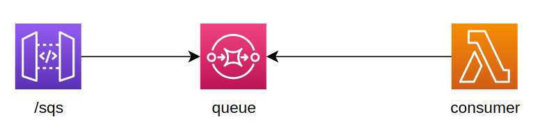
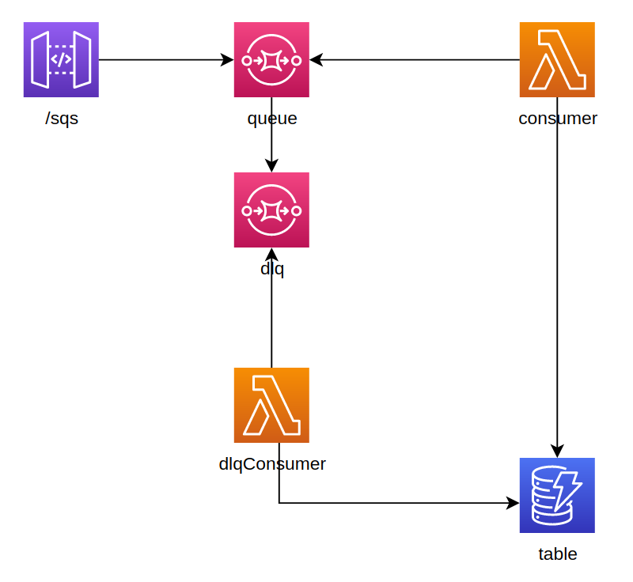
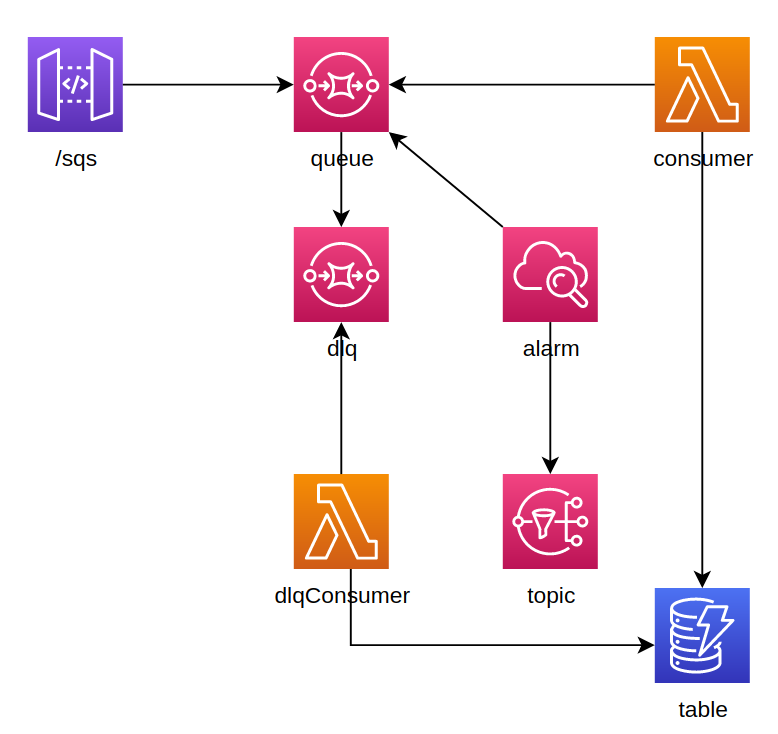
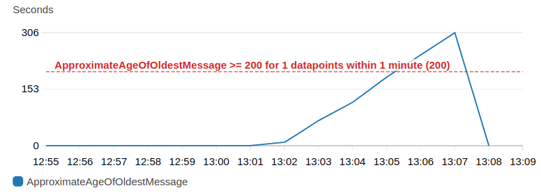

## Meet SQS
Let's suppose we want to process some messages with lambdas but limiting the system throughput to avoid overloading a downstream system. So after the API Gateway, which is our entrypoint to send the messages, we put an SQS before the processing lambda, this lambda would be the SQS consumer.

SQS help us as a buffer, it sends an array `Records` to consumer lambdas, in that array it may package just one or several messages (maximum 10).

<p align="center">
  
</p><br />

For the purpose of this demo, every lambda simulates a 10s processing time for every array, no matter if that array has 1 or 10 messages, the lambda will take 10s to process the whole array or chunk.

## Lambda concurrent executions

We'll use [Artillery](https://artillery.io) to check how the systems behaves when 60 messages are sent to API Gateway.
> If you want to run Artillery on your side this is how you run it:
> ```shell
> export API=https://<your_api_id>.execute-api.us-east-1.amazonaws.com/run
> artillery run artillery/artillery.yml
> ```

Let's first see what happens when we allow consumer lambdas scale without limiting the number of concurrent executions. 

**CASE 1**<br/>

**Artillery run**<br/>
Launch time: 14:04:00<br/>
Scenarios / messages: 60<br/>
Elapsed time / time that took sending the messages: 2s

**Lambda executions (without setting**
`reservedConcurrentExecutions`
**)**<br />			
Concurrent executions: 13
Log stream | RequestId | Messages received | Request start time | Request end time
--- | --- | ---: | ---: | ---:
95 | 361d | 1 | 14:04:01 | 14:04:11
31f | 9fd8 | 1 | 14:04:01 | 14:04:11
f40 | a28 | 1 | 14:04:01 | 14:04:11
4d3 | 8f7 | 1 | 14:04:01 | 14:04:11
94d | a7c | 1 | 14:04:01 | 14:04:11
08de | 5ae | 8 | 14:04:05 | 14:04:15
90e2d | 627 | 7 | 14:04:05 | 14:04:15
074a | e16 | 10 | 14:04:07 | 14:04:17
920aa | ec1 | 9 | 14:04:07 | 14:04:17
0df2 | a98 | 1 | 14:04:08 | 14:04:18
e197 | b23 | 10 | 14:04:09 | 14:04:19
9170 | ab97 | 1 | 14:04:09 | 14:04:19
f30 | a42 | 9 | 14:04:10 | 14:04:20
**Total** | | **60**
**Min time** | | | **14:04:01**	| **14:04:11**
**Max time** | | | **14:04:10** | **14:04:20**
**Processing time** | | | | **00:00:19**


When we don’t set `reservedConcurrentExecutions`, SQS will package the messages in arrays or chunks of 1 to 10 messages and send them to Lambda which can scale freely without limitations, so AWS launches as many lambdas as chunks are sent from SQS.

In this case SQS packaged the 60 messages in 13 chunks, 13 lambdas were instantiated (all of them with cold starts). We can see the first 5 chunks were sent to Lambda right away, although the following chunks took more time for being sent. The 13 chunks took around 20s to be processed.

With that insight about having only 5 lambdas processing the SQS messages immediately, we can check what happens if we set `reservedConcurrentExecutions` to 5.

**CASE 2**<br/>

**Artillery run**<br/>
Launch time: 05:58:00<br/>
Scenarios / messages: 60<br/>
Elapsed time / time that took sending the messages: 2s

**Lambda executions setting**
`reservedConcurrentExecutions`
**to 5**<br />			
Concurrent executions: 5
Log stream | RequestId | Messages received | Request start time | Request end time | Time between requests
--- | --- | ---: | ---: | ---: | ---:
c1a | 3f7 | 1 | 05:58:01 | 05:58:11
  " | 2d7 | 8 | 05:58:16 | 05:58:26 | 00:00:05
835 | 028 | 1 | 05:58:01 | 05:58:11
  " | c97 |10 | 05:58:14 | 05:58:24 | 00:00:03
8b6 |c218 | 1 | 05:58:01 | 05:58:11
  " | ec3 | 1 | 05:58:13 | 05:58:23 | 00:00:02
  " | 9a2 |10 | 05:58:23 | 05:58:33 | 00:00:00
aae | ff8 | 1 | 05:58:01 | 05:58:11
  " | a36 | 8 | 05:58:11 | 05:58:21 | 00:00:00
  " | 91a | 6 | 05:58:23 | 05:58:33 | 00:00:02
7f0 |bb8c | 1 | 05:58:01 | 05:58:11
  " |e916 |10 | 05:58:11 | 05:58:21 | 00:00:00
  " |7d3b | 2 | 05:58:23 | 05:58:33 | 00:00:02
**Total** | | **60**
**Min time** | | | **05:58:01**	| **05:58:11**
**Max time** | | | **05:58:23** | **05:58:33**
**Processing time** | | | | **00:00:32**

When we set `reservedConcurrentExecutions` to 5, instead of one lambda processing one request, we process several requests with the same lambda. In this case, SQS also divided the 60 messages in 13 chunks, so the lambdas have to process more than 1 chunk. We can see that as in CASE 1, the 5 lambdas start processing its first chuck immediately but as several chunks have to be processed by the same lambda, all the 13 chunks took around 30s.

## Lambda failures

Let's now check what happens if we modify the consumer lambda to throw an error if it receives more than 5 messages in its chunk.

**CASE 3**<br/>

**Artillery run**<br/>
Launch time: 10:23:02<br/>
Scenarios / messages: 60<br/>
Elapsed time / time that took sending the messages: 2s

**Lambda executions setting**
`reservedConcurrentExecutions`
**to 5**<br />	
Concurrent executions: 5
Log stream | RequestId | Messages received | Request start time | Request end time | Time between requests | thow?
--- | --- | ---: | ---: | ---: | ---: | ---
2d3 |9405 | 1 | 10:23:02 | 10:23:12
  " | fa5 | 1 | 10:25:09 | 10:25:19 | 00:01:57
  " | 9df | 6 | 10:25:20 | 10:25:20 | 00:00:01 | ERROR
  " |8047 | 7 | 10:25:20 | 10:25:20 | 00:00:00 | ERROR
  " |9557 | 9 | 10:25:26 | 10:25:26 | 00:00:06 | ERROR
  " |8d3a | 1 | 10:27:06 | 10:27:16 | 00:01:40
  " |574b | 6 | 10:27:18 | 10:27:18 | 00:00:02 | ERROR
  " |faf2 | 2 | 10:29:18 | 10:29:28 | 00:02:00
d228|1417 | 1 | 10:23:02 | 10:23:13
  " |eceb | 2 | 10:25:08 | 10:25:18 | 00:01:55
  " |d2a3 | 2 | 10:27:06 | 10:27:16 | 00:01:48
  " |e90d | 4 | 10:27:17 | 10:27:27 | 00:00:01
  " |a755 | 5 | 10:29:08 | 10:29:18 | 00:01:41
1993|623b | 1 | 10:23:03 | 10:23:13
  " |b801 |10 | 10:23:21 | 10:23:21 | 00:00:08 | ERROR
  " |fd95 | 1 | 10:25:08 | 10:25:18 | 00:01:47 
  " |a4f8 | 3 | 10:27:08 | 10:27:18 | 00:01:50
  " |a0f0 | 2 | 10:27:20 | 10:27:30 | 00:00:02
  " |1d47 | 1 | 10:29:08 | 10:29:18 | 00:01:38
0a58|719f | 1 | 10:23:03 | 10:23:13
  " |e3ba | 6 | 10:23:17 | 10:23:17 | 00:00:04 | ERROR
  " |b218 | 7 | 10:23:18 | 10:23:18 | 00:00:01 | ERROR
  " |1bf3 | 7 | 10:23:18 | 10:23:18 | 00:00:00 | ERROR
  " |db06 | 2 | 10:23:19 | 10:23:29 | 00:00:01
  " |aaaf | 1 | 10:25:05 | 10:25:15 | 00:01:36
  " |7661 | 7 | 10:25:15 | 10:25:15 | 00:00:00 | ERROR
  " |cc2c | 6 | 10:25:17 | 10:25:17 | 00:00:02 | ERROR
  " |a849 | 4 | 10:25:17 | 10:25:27 | 00:00:00
  " |21ca | 1 | 10:27:06 | 10:27:16 | 00:01:39
  " |5d2d | 4 | 10:27:17 | 10:27:27 | 00:00:01
  " |abc6 | 1 | 10:29:08 | 10:29:18 | 00:01:41
  " |ebfe | 1 | 10:29:19 | 10:29:29 | 00:00:01
d202|9f99 | 3 | 10:23:03 | 10:23:13
  " |07ae | 7 | 10:23:14 | 10:23:14 | 00:00:01 | ERROR
  " |9166 | 9 | 10:23:16 | 10:23:16 | 00:00:02 | ERROR
  " |22d7 | 5 | 10:23:17 | 10:23:27 | 00:00:01
  " |d63d | 2 | 10:25:05 | 10:25:15 | 00:01:38
  " |2024 | 9 | 10:27:11 | 10:27:11 | 00:01:56 | ERROR
  " |efee | 3 | 10:27:14 | 10:27:24 | 00:00:03
  " |c9ce | 2 | 10:29:08 | 10:29:18 | 00:01:44
  " |d159 | 3 | 10:29:19 | 10:29:29 | 00:00:01
**Total** | | **156**
**Errored** | | **96**
**Result** | | **60**
**Min time** | | | **10:23:02**	| **10:23:12**
**Max time** | | | **10:29:19** | **10:29:29**
**Processing time** | | | | **00:06:27**

The messages packed in greater that 5 messages chunks errored, so we have to wait the 2m `visibilityTimeout` to try to process them again, as those failed messages are re-arranged in chunks of different sizes, eventually they get packaged in chunks of 5 or fewer messages, and they are processed well.

> By setting a `visibilityTimeout` less than 5m we don’t get cold starts because the lambdas are still warm when the processing of messages is retried

For example, when I trace back one of the last messages processed (log stream d202 RequestId d159) which had a messageId 7cf3466a-c387-4414-90d9-61d7fc3a3a29, I can see all the times it was tried to be processed before, if we arrange them in chronological order:

Log stream | RequestId | Messages received | Request start time | Request end time | Time between requests | thow? | ApproximateReceiveCount
--- | --- | ---: | ---: | ---: | ---: | --- | :---:
1993|b801 |10 | 10:23:21 | 10:23:21 | 00:00:08 | ERROR | 1
f2d3| 9df | 6 | 10:25:20 | 10:25:20 | 00:00:01 | ERROR | 2
  " |574b | 6 | 10:27:18 | 10:27:18 | 00:00:02 | ERROR | 3
d202|d159 | 3 | 10:29:19 | 10:29:29 | 00:00:01 |       | 4
<br />

We could also have set consumer lambda to error when it receives more than just 1 message in its chunk, and it will eventually have processed all the messages. 

## Unprocessable message

Let's see now what happens when we mark one message so in the case it's in the chunk being processed by lambda it will always throw an error, remaining unprocessable.

As soon as we receive the first messages in consumer lambda we will save a messageId to a dynamo table (with `id: "unprocessable"`) and whenever we receive that message in the chunk, lambda will error. **To make this work you should start without any item with that id in the table, so make sure you delete that item before running Artillery.**

Doing that way, we'll end up having a chunk with this single message, tried to be processed successfully for consumer lambda over and over every the 2m `visibilityTimeout`. In that case, apart the message attribute `ApproximateReceiveCount`, attributes `SentTimestamp` and `ApproximateFirstReceiveTimestamp` are helpful to know the message aging. In the SQS console, the message will appear as "Messages in flight".

So to avoid having a message being endlessly tried, it's helpful to configure a `deadLetterQueue`, so whenever a message is failed to be processed `maxReceiveCount` times, it will be send to that queue.<br />

<p align="center">
  
</p><br />

## Approximate Age Of Oldest Message

This is an important metric to keep an eye on, for demonstration purposes let's set an alarm so it goes off.

If in our queue we have an unprocessable message that will be sent to the dead letter queue when it was tried to be processed 3 times (`maxReceiveCount`) and we have a `visibilityTimeout` equal to 120s, that means that the first time the message is tried to be processed right away and will error, after 120s will be tried to process for second time and there is still a third last attempt when the message has been around for 240s.

So, let's create an alarm computed every minute so it goes off when the message has been around for more than 200s.

<p align="center">
  
</p><br />

We also create an SNS topic and subscription with our email, just create a `.env` file with something like this:
```dotenv
EMAIL=your_email_here
```

Once you deploy, you'll receive an email to confirm the subscription.

Here it's the alarm in action:<br />

<p align="center">
  
</p><br />

The age of the unprocessable message builds up until fails for 3rd time, that happens at an age of around two times the `visibilityTimeout` and then it's sent to the dead letter queue so we end up without messages in our queue. 
